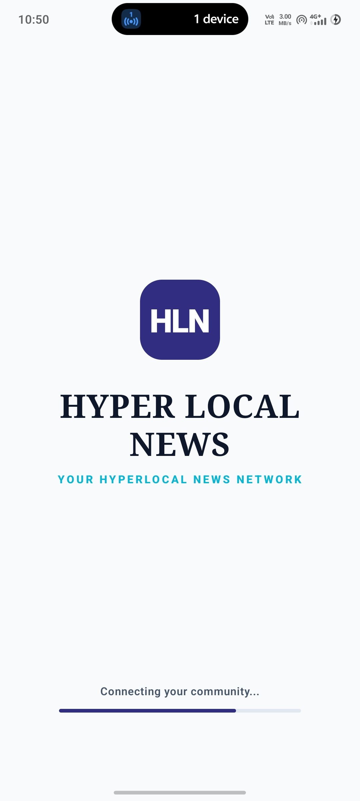
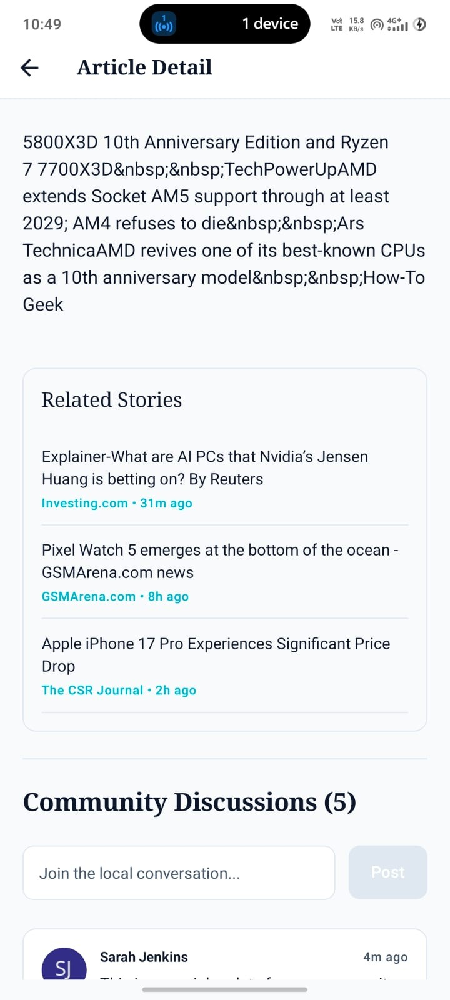
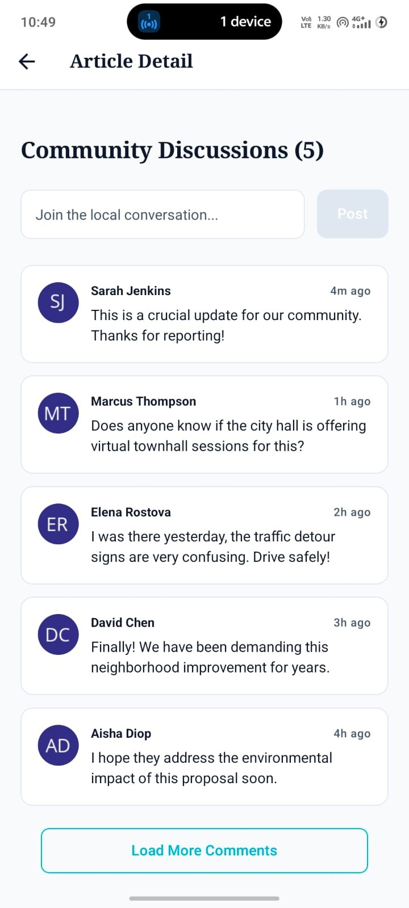
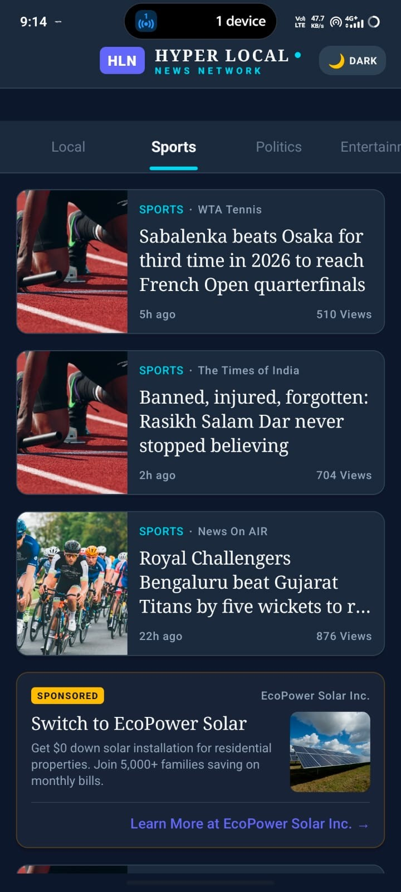

# HYPER LOCAL NEWS (HLN) — React Native Mobile Module

An enterprise-grade, high-performance hyperlocal news mobile application for React Native, engineered with **Clean Feature-Driven Architecture**, custom **Light/Dark theme support**, and a buttery-smooth 60fps feed catalog.

---

## 📱 Screenshots of UI (Chronological Flow)

<div align="center">
  <table>
    <tr>
      <td align="center"><b>1. Onboarding Splash Onset</b></td>
      <td align="center"><b>2. Live Category Recycler</b></td>
      <td align="center"><b>3. Article Reading Hero</b></td>
    </tr>
    <tr>
      <td></td>
      <td></td>
      <td></td>
    </tr>
    <tr>
      <td align="center"><b>4. Contextual Related Stories</b></td>
      <td align="center"><b>5. Live Community Discussions</b></td>
      <td align="center"><b>6. Interactive Dark Mode</b></td>
    </tr>
    <tr>
      <td></td>
      <td></td>
      <td></td>
    </tr>
  </table>
</div>

---

## 🚀 Key Features

* 🚀 **Automated Splash Page & Progress Tracker**: Beautiful onboarding screen featuring a centered modern badge, responsive tracking subtitle, and a spring-loaded loading bar tracking from 0% to 100% over 2.2 seconds before automatically transitioning to the feed.
* 🗂 **Gliding Tab Category Slider**: Spaced horizontal category selector where the active tab expands, and a shared Reanimated indicator underline glides smoothly beneath the selected tab with spring-snapping physics.
* ⚡ **Dynamic Recycler Feed (60 FPS)**: Powered by Shopify’s high-frequency recycler list (`@shopify/flash-list`) which reduces memory footprint on long scrolling sessions.
* 🌐 **Direct Client-Side RSS XML Parser**: Requests live Google News RSS feeds directly (avoiding cached proxy servers), parsing real-time headlines, publisher details, and extracting real thumbnail images from XML CDATA descriptions natively.
* 📍 **Automated User Geolocation**: Requests GPS coordinate permission at runtime using `expo-location` and reverse-geocodes it into the actual Indian city name (e.g. *Gooty*) to load local town bulletins.
* 🏭 **Feed Card Factory**: Resolves cards dynamically via a compile-safe static factory mapping news headlines, sponsored advertisements, and local community events.
* 🛡 **Strategy-Pattern Error Recovery**: Combines **Exponential Backoff Retries** (RetryStrategy), **Storage Caching fallback** (AsyncStorage), and **Visual UI error handlers** to guarantee offline-first reliability.
* 💬 **Optimistic Comments Submissions**: A standalone comment thread supporting lazy paging and instant UI optimistic rendering with automatic rollback on network failure.
* 🌓 **Premium Theme Engine**: Type-safe themes containing responsive typographic scales (Georgia Serif & System Sans), dynamic shadows, and interactive light/dark theme selection.
* 🧪 **Robust Automated Test Foundation**: Complete Jest unit test coverage covering repositories, state slices, factories, and retry backoffs.

---

## 🎨 Architectural Design Patterns

This module implements key production-grade software design patterns:

| Design Pattern | Application Target | Operational Responsibility |
| :--- | :--- | :--- |
| **Container-Presenter** | Category Slider | Separates active Redux listener hook states (`CategoryContainer`) from layout-snapping UI styles (`CategorySlider`). |
| **Factory Pattern** | Feed Card Generator | Uses `CardFactory` to map JSON arrays to modular cards (`NewsCard`, `AdCard`, `EventCard`) without nested switch statement clutter. |
| **Repository Pattern** | Data Access Layer | Decouples data retrieval (`INewsRepository`) so you can swap Mock and production Axios modules via central configuration toggles. |
| **Strategy Pattern** | Resilient Error Recovery | Automatically routes failure paths through `RetryStrategy` (backoff loops), `CacheFallbackStrategy` (AsyncStorage), and `ErrorUIStrategy`. |
| **Observer Pattern** | Redux Store | Subscribes widgets to precise slice updates using memoized selectors (`createSelector`) to prevent redundant re-renders. |

---

## 📁 Folder Structure

```
src/
├── core/
│   ├── navigation/        # AppNavigator (Stack with custom logo badge), types (Type-safe parameters)
│   ├── theme/             # Light/Dark dynamic design palettes, dynamic scales
│   ├── constants/         # USE_MOCK_DATA flags, retry counts, storage keys
│   ├── utils/             # Relative time formatting helper libraries
│   ├── types/             # Domain entities (NewsArticle, Comment, FeedItem)
│   └── mocks/             # High-fidelity mock updates and community logs
│   └── utils/time.ts      # Relative time formatting helper libraries
└── features/
    └── news/
        ├── components/    # CategorySlider, cards, skeletons, and offline banners
        ├── containers/    # CategoryContainer
        ├── screens/       # NewsFeedScreen, ArticleDetailScreen, WelcomeScreen
        ├── repository/    # INewsRepository, Mock/API endpoints, client-side XML parser
        ├── factory/       # CardFactory dynamic resolver
        ├── strategies/    # ErrorStrategy base, Retry, CacheFallback, ErrorUI strategy
        ├── hooks/         # useNewsFeed and useComments hooks
        ├── store/         # RTK configurations and newsSlice
        └── __tests__/     # Jest unit test collections
```

---

## ⚡ Quick Start & Run Instructions

### 1. Prerequisites
Ensure you have Node.js installed, then clone the repository:
```bash
git clone <YOUR_REPOSITORY_URL>
cd "Hyperlocal News app"
```

### 2. Install Dependencies
```bash
npm install
```

### 3. Run Automated Testing Suite
Validate our design patterns and store reducers instantly:
```bash
npm test
```

### 4. Boot the App in Expo Go
Start the Metro bundler and generate the QR code using your computer's active Wi-Fi IP address:
```bash
$env:REACT_NATIVE_PACKAGER_HOSTNAME="YOUR_PC_WIFI_IP"; npx expo start --clear
```
1. Download the **Expo Go** app on your phone.
2. Scan the terminal's QR code.
3. The app will bundle and render live in seconds!

---

## ♿ Accessibility First

The module satisfies WCAG AA guidelines:
* **Minimum Touch targets** of 44x44 points.
* **Typographic scale** optimized for Dynamic Font Scaling screen reader support.
* **Explicit screen reader tags** (`accessibilityRole`, `accessibilityLabel`, `accessibilityState`).
